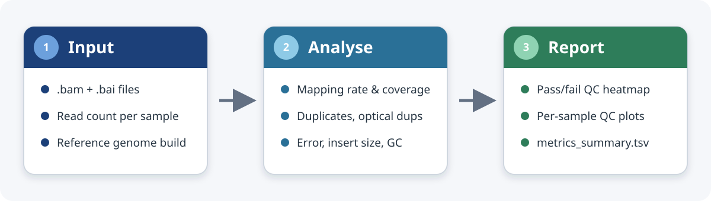

---
params:
  reportTitle: "DNA BAM Stats"
  # B-Fabric identifiers, shown in Report provenance and used to name the ZIP the
  # Download panel builds. Leave empty to auto-detect from the render path (a
  # gstore-style .../pXXXXX/oXXXXX_App_date/... yields both); pass explicitly when
  # rendering somewhere that has no such path (e.g. an /srv/GT/analysis validation
  # dir, which carries neither id).
  project: ""
  order: ""
title: "`r params$reportTitle`"
---

<!-- Styling comes from the fgczQuartoTemplate assets staged next to this file by
     makeQuartoReport() -> fgczQuartoTemplate::fgcz_render() (_metadata.yml is
     applied by Quarto automatically, so there is no `format:` block here). The
     Find/Download toolbar and tab colour/numbering are render-time arguments of
     fgcz_render(), not params. -->

```{r setup}
#| include: false
library(ezRun)
library(DT)
library(htmltools)
library(knitr)
library(plotly)
library(tidyverse)
```

```{r dna-bamstats-style}
#| results: asis
#| echo: false
## Keep the DT wrappers auto-width and left-aligned, as in the .Rmd.
cat(
  "<style>",
  ".dna-bamstats-table { display: inline-block; width: auto; max-width: 100%; }",
  "</style>",
  sep = ""
)
```

```{r prepare-data}
#| include: false
## Same qs2 objects makeQuartoReport() wrote (dataset/param/resultList/reportData),
## read back with the ezRun loader (auto-detects the .qs2). Under Quarto the
## report runs in a fresh session, so nothing pre-exists in the environment.
if (!exists("dataset")) {
  dataset <- ezLoadRobj("dataset")
}
if (!exists("param")) {
  param <- ezLoadRobj("param")
}
if (!exists("resultList")) {
  resultList <- ezLoadRobj("resultList")
}
if (!exists("reportData") && !is.null(ezFindRobj("reportData"))) {
  reportData <- ezLoadRobj("reportData")
}
if (!exists("reportData")) {
  reportData <- list()
}

samples <- rownames(dataset)
if (is.null(reportData$reviewOrder)) {
  reportData$reviewOrder <- samples
}
if (is.null(reportData$fullSummaryTable)) {
  reportData$fullSummaryTable <- reportData$overviewTable
}
if (is.null(reportData$quickViewTable)) {
  reportData$quickViewTable <- reportData$fullSummaryTable
}
if (is.null(reportData$resourceTable)) {
  reportData$resourceTable <- data.frame(Sample = samples, stringsAsFactors = FALSE)
}
if (is.null(reportData$inputDatasetTable)) {
  reportData$inputDatasetTable <- data.frame(Sample = samples, stringsAsFactors = FALSE)
}
if (is.null(reportData$flagSummaryTable)) {
  reportData$flagSummaryTable <- data.frame(
    Flag = character(),
    SamplesAffected = numeric()
  )
}
if (is.null(reportData$qcThresholds)) {
  reportData$qcThresholds <- data.frame(
    Flag = character(),
    Metric = character(),
    Direction = character(),
    Threshold = numeric(),
    Unit = character()
  )
}
if (is.null(reportData$legacyAvailabilityNotes)) {
  reportData$legacyAvailabilityNotes <- list(
    alignment = character(),
    duplicates = character(),
    resources = character()
  )
}

fullSummaryTable <- reportData$fullSummaryTable
quickViewTable <- reportData$quickViewTable
resourceTable <- reportData$resourceTable
inputDatasetTable <- reportData$inputDatasetTable
flagSummaryTable <- reportData$flagSummaryTable
qcThresholds <- reportData$qcThresholds
reviewOrder <- reportData$reviewOrder
legacyAvailabilityNotes <- reportData$legacyAvailabilityNotes

metricPlotHeight <- min(max(300, 60 + 15 * length(reviewOrder)), 1500)
hasMmCounts <- FALSE
mmPlotWidth <- 8
```

```{r helper-functions}
#| include: false
make_resource_link <- function(path) {
  if (is.null(path) || is.na(path) || path == "" || !file.exists(path)) {
    return("")
  }
  paste0('<a href="', path, '">', basename(path), "</a>")
}

make_qualimap_link <- function(path) {
  if (is.null(path) || is.na(path) || path == "" || !file.exists(path)) {
    return("")
  }
  paste0('<a href="', path, '">', basename(dirname(path)), "/qualimapReport.html</a>")
}

render_sample_image_gallery <- function(colName, emptyMsg) {
  if (is.null(resourceTable[[colName]])) {
    cat(emptyMsg, "\n\n")
    return(invisible(NULL))
  }
  pathBySample <- setNames(resourceTable[[colName]], resourceTable$Sample)
  items <- character(0)
  for (sm in reviewOrder) {
    p <- pathBySample[[sm]]
    if (!is.null(p) && !is.na(p) && p != "" && file.exists(p)) {
      items <- c(
        items,
        paste0(
          '<figure style="margin:0;">',
          '<figcaption style="font-weight:500;font-size:13px;margin-bottom:4px;word-break:break-all;">',
          sm,
          '</figcaption>',
          '',
          '</figure>'
        )
      )
    }
  }
  if (length(items) == 0) {
    cat(emptyMsg, "\n\n")
    return(invisible(NULL))
  }
  cat('\n<div style="display:grid;grid-template-columns:repeat(3,1fr);gap:14px;align-items:start;">\n')
  cat(paste(items, collapse = "\n"))
  cat("\n</div>\n\n")
  invisible(NULL)
}

get_threshold_row <- function(metricName) {
  idx <- which(qcThresholds$Metric == metricName)
  if (length(idx) == 0) {
    return(NULL)
  }
  qcThresholds[idx[1], , drop = FALSE]
}

alignmentCountBarPlotDna <- function(mmCounts, relative = FALSE, file = NULL) {
  multiCountColors <- c(
    "0 hit(s)" = "#9e9e9e",
    "1 hit(s)" = "#1f77b4",
    "2 hit(s)" = "#ff7f0e",
    "3 hit(s)" = "#2ca02c",
    ">3 hit(s)" = "#d62728"
  )
  alignmentCountBarPlot(
    mmCounts = mmCounts,
    relative = relative,
    file = file,
    multiCountColors = multiCountColors
  )
}

plotDataBase <- fullSummaryTable[
  match(reviewOrder, fullSummaryTable$Sample),
  ,
  drop = FALSE
]
plotDataBase$SampleFactor <- factor(
  plotDataBase$Sample,
  levels = rev(reviewOrder)
)

make_metric_plot <- function(
  metricName,
  title,
  unit = "",
  showLabels = FALSE,
  thresholded = TRUE,
  xMax = NULL
) {
  plotData <- plotDataBase

  thresholdRow <- if (thresholded) {
    get_threshold_row(metricName)
  } else {
    NULL
  }
  if (!is.null(thresholdRow)) {
    flagName <- thresholdRow$Flag[1]
    plotData$PointColor <- ifelse(plotData[[flagName]], "#b22222", "#7f7f7f")
    thresholdText <- paste0(
      ifelse(thresholdRow$Direction[1] == "below", "< ", "> "),
      sprintf("%.1f", thresholdRow$Threshold[1]),
      thresholdRow$Unit[1]
    )
  } else {
    plotData$PointColor <- "#7f7f7f"
    thresholdText <- NULL
  }

  metricValues <- plotData[[metricName]]
  metricLabels <- format_dna_bamstats_metric(metricValues, unit = unit)
  hoverText <- if (!is.null(thresholdText)) {
    paste(
      "Sample:", plotData$Sample,
      "<br>Value:", metricLabels,
      "<br>Threshold:", thresholdText
    )
  } else {
    paste(
      "Sample:", plotData$Sample,
      "<br>Value:", metricLabels
    )
  }

  plotObj <- plot_ly(
    data = plotData,
    x = metricValues,
    y = ~SampleFactor,
    type = "scatter",
    mode = "markers",
    text = hoverText,
    hovertemplate = "%{text}<extra></extra>",
    marker = list(
      size = 8,
      color = plotData$PointColor,
      line = list(color = "#333333", width = 0.7)
    ),
    hoverlabel = list(
      bgcolor = "rgba(255,255,255,0.78)",
      bordercolor = "#666666",
      font = list(color = "#222222")
    ),
    showlegend = FALSE
  ) %>%
    layout(
      height = metricPlotHeight,
      xaxis = c(
        list(title = if (nzchar(unit)) paste0(title, " (", trimws(unit), ")") else title),
        if (is.null(xMax)) {
          list(rangemode = "tozero")
        } else {
          list(range = c(0, xMax))
        }
      ),
      yaxis = list(
        title = "",
        showticklabels = showLabels
      ),
      margin = list(l = if (showLabels) 130 else 40, r = 20, t = 30, b = 60)
    )

  if (!is.null(thresholdRow)) {
    plotObj <- plotObj %>%
      layout(
        shapes = list(
          list(
            type = "line",
            x0 = thresholdRow$Threshold[1],
            x1 = thresholdRow$Threshold[1],
            y0 = 0,
            y1 = 1,
            yref = "paper",
            line = list(color = "#333333", dash = "dash", width = 1.2)
          )
        )
      )
  }

  plotObj
}

resourceTableDisplay <- resourceTable
if (nrow(resourceTableDisplay) > 0) {
  resourceTableDisplay$QualimapReport <- vapply(
    resourceTable$QualimapReport,
    make_qualimap_link,
    character(1)
  )
  resourceTableDisplay$PicardMetrics <- vapply(
    resourceTable$PicardMetrics,
    make_resource_link,
    character(1)
  )
  resourceTableDisplay$FragmentSizePlot <- vapply(
    resourceTable$FragmentSizePlot,
    make_resource_link,
    character(1)
  )
  resourceTableDisplay$LibraryComplexityPlot <- vapply(
    resourceTable$LibraryComplexityPlot,
    make_resource_link,
    character(1)
  )
}

fullSummaryTableDisplay <- fullSummaryTable
if ("TriggeredFlags" %in% colnames(fullSummaryTableDisplay)) {
  fullSummaryTableDisplay$TriggeredFlags <- vapply(
    seq_len(nrow(fullSummaryTableDisplay)),
    function(i) {
      flagText <- get_dna_bamstats_triggered_flags_text(
        sampleRow = fullSummaryTableDisplay[i, , drop = FALSE],
        qcThresholds = qcThresholds,
        formatted = TRUE
      )
      if (is.na(flagText) || flagText == "") {
        return("NoFlags")
      }
      gsub("; ", "<br>", flagText, fixed = TRUE)
    },
    character(1)
  )
}
```

```{r fgcz-bfabric}
#| include: false
## B-Fabric identity + provenance, resolved once and reused by the Download
## panel's ZIP name and the Report provenance tab (mirrors CountQC.qmd). Unlike
## CountQC there is no `output` object in this report, so the structured
## "Order Id [B-Fabric]" source is read from the input dataset metadata and the
## path sources are param$resultDir + getwd(). Sources are tried in order of
## trustworthiness; the first hit wins; anything unresolved stays "" and is not
## displayed. Under an /srv/GT/analysis validation dir neither id is in the path,
## so pass -P project/-P order explicitly there.

## First non-empty value of a column on the input dataset, or "".
.fgcz_meta <- function(col) {
  v <- tryCatch(unique(dataset[[col]]), error = function(e) NULL)
  v <- as.character(v[!is.na(v)])
  v <- v[nzchar(v)]
  if (length(v)) v[1] else ""
}

.fgcz_id <- function(explicit, prefix) {
  x <- as.character(explicit %||% "")
  if (!nzchar(x)) {
    sources <- c(
      as.character(param$resultDir %||% ""),
      getwd()
    )
    pat <- sprintf("(?<![A-Za-z0-9])%s[0-9]{3,6}(?![0-9])", prefix)
    for (s in sources) {
      if (!nzchar(s)) next
      hits <- regmatches(s, gregexpr(pat, s, perl = TRUE))[[1]]
      ## Last match wins: a nested working copy under another project's tree
      ## still resolves to the directory actually being rendered.
      if (length(hits)) { x <- hits[length(hits)]; break }
    }
  }
  if (!nzchar(x)) return("")
  ## Accept a bare number ("36207") as well as a prefixed one ("p36207").
  if (!grepl(sprintf("^%s", prefix), x)) x <- paste0(prefix, x)
  x
}
## The order has a structured source, so prefer it over parsing a path.
.fgcz_order_explicit <- as.character(params$order %||% "")
if (!nzchar(.fgcz_order_explicit)) {
  .fgcz_order_explicit <- .fgcz_meta("Order Id [B-Fabric]")
}

.fgcz_project <- .fgcz_id(params$project, "p")
.fgcz_order   <- .fgcz_id(.fgcz_order_explicit, "o")

## Who rendered this, and when. Under SUSHI Sys.info() is the service account.
.fgcz_user <- unname(Sys.info()[["user"]])
if (!nzchar(.fgcz_user %||% "")) .fgcz_user <- Sys.getenv("USER", "unknown")
.fgcz_rendered <- format(Sys.time(), "%Y-%m-%d %H:%M:%S %Z")
```

::: {.panel-tabset}

# Overview

::: {.callout-note}
## What this report is

**DNA BAM Stats** is a cohort-level quality-control report for aligned DNA
sequencing data — one coordinate-sorted BAM per sample. It does not call
variants or test a hypothesis; it answers "are these alignments sound enough to
analyse?" before downstream work begins.

Metrics come from **Qualimap** (mapping rate, coverage, error profile) and
**Picard** (duplicates), with per-sample insert-size and library-complexity
diagnostics for paired-end data. Read it worst-first:

1. **QC Summary** — a per-sample pass/fail heatmap over the four thresholded QC
   checks; failing samples sort to the top.
2. **Alignment & Coverage** / **Duplicates** / **Error Profile** — dot-plots and
   per-sample galleries in the same review-priority order.
3. **Tables** and **Resources** — the machine-readable summary plus per-sample
   Qualimap/Picard drilldowns.
:::

```{r overview-visual-abstract}
#| fig-cap: "Visual abstract of the DNA BAM QC workflow."
#| out-width: "60%"
#| fig-alt: >-
#|   Three connected cards labelled BAMs, QC metrics, and Cohort report. The
#|   BAMs card lists coordinate-sorted DNA alignments and read counts, the QC
#|   metrics card lists Qualimap mapping/coverage/error and Picard duplicates,
#|   and the Cohort report card lists a pass/fail heatmap, per-sample plots, and
#|   a metrics summary table.
if (!file.exists("dna-bamstats-overview.svg")) {
  file.copy(
    system.file("templates/dna-bamstats-overview.svg", package = "ezRun"),
    "."
  )
}

```

::: {.at-a-glance}

## At a glance

```{r overview-input-summary}
#| echo: false
## Plain, human-readable summary of what went in. Identifiers and timestamps
## live in Session Info, not here.
.flagged <- if (!is.null(fullSummaryTable$FlagCount)) {
  sum(fullSummaryTable$FlagCount > 0, na.rm = TRUE)
} else {
  NA
}
.ov <- c(
  "Samples"           = length(samples),
  "Paired-end"        = if (!is.null(param$paired)) ifelse(isTRUE(param$paired), "yes", "no") else NA,
  "Qualimap metrics"  = if (!is.null(param$runQualimap)) ifelse(isTRUE(param$runQualimap), "yes", "no") else NA,
  "Picard duplicates" = if (!is.null(param$runPicard)) ifelse(isTRUE(param$runPicard), "yes", "no") else NA,
  "Species"           = .fgcz_meta("Species"),
  "Reference build"   = .fgcz_meta("refBuild"),
  "Samples flagged"   = if (is.na(.flagged)) NA else paste0(.flagged, " / ", length(samples))
)
.ov <- .ov[!is.na(.ov) & nzchar(as.character(.ov))]
knitr::kable(
  data.frame(Field = names(.ov), Value = as.character(.ov), check.names = FALSE),
  caption = "Input summary for this run."
)
```

:::

# QC Summary

Per-sample QC status: grey = passed, red = failed. Each cell shows the metric
value; rows are ordered worst-first.

```{r quick-view-heatmap}
#| echo: false
#| out-width: "80%"
#| fig-width: 7
#| fig-height: !expr "min(max(2.2, 0.3 * length(reviewOrder) + 1.2), 16)"
#| fig-cap: "Per-sample QC pass/fail heatmap over the four thresholded checks; each cell is annotated with the observed metric value, samples ordered worst-first."
qcChecks <- list(
  list(name = "Mapping rate",     val = "MappingRate",     flag = "LowMappingRate",            unit = "%"),
  list(name = "Average\ncoverage", val = "AverageCoverage", flag = "LowAverageCoverage",         unit = "x"),
  list(name = "Duplication\nrate", val = "DuplicationRate", flag = "HighDuplicationRate",        unit = "%"),
  list(name = "Optical\nduplication\nrate", val = "OpticalDupRate",  flag = "HighOpticalDuplicationRate", unit = "%")
)

hmData <- do.call(rbind, lapply(qcChecks, function(chk) {
  values <- fullSummaryTable[[chk$val]]
  failed <- if (!is.null(fullSummaryTable[[chk$flag]])) {
    fullSummaryTable[[chk$flag]]
  } else {
    rep(FALSE, nrow(fullSummaryTable))
  }
  label <- format_dna_bamstats_metric(values, unit = chk$unit)
  label[is.na(label)] <- "NA"
  data.frame(
    Sample = fullSummaryTable$Sample,
    Check = chk$name,
    Label = label,
    Status = ifelse(is.na(values), "na", ifelse(failed, "fail", "pass")),
    stringsAsFactors = FALSE
  )
}))
hmData$Sample <- factor(hmData$Sample, levels = rev(reviewOrder))
hmData$Check <- factor(hmData$Check, levels = vapply(qcChecks, function(x) x$name, character(1)))
hmData$Status <- factor(hmData$Status, levels = c("pass", "fail", "na"))

ggplot(hmData, aes(x = Check, y = Sample, fill = Status)) +
  geom_tile(color = "black", linewidth = 0.6) +
  geom_text(aes(label = Label, color = Status), size = 3.4) +
  scale_fill_manual(
    values = c(pass = "#bdbdbd", fail = "#c0392b", na = "#ffffff"),
    labels = c(pass = "QC passed", fail = "QC failed", na = "not available"),
    drop = FALSE, name = NULL
  ) +
  scale_color_manual(
    values = c(pass = "#222222", fail = "#ffffff", na = "#888888"),
    guide = "none"
  ) +
  scale_x_discrete(position = "top") +
  labs(x = NULL, y = NULL) +
  theme_minimal(base_size = 12) +
  theme(
    panel.grid = element_blank(),
    axis.text.x = element_text(face = "bold", vjust = 0),
    axis.ticks = element_blank(),
    legend.position = "bottom"
  )
```

::: {.callout-note collapse="true"}
## Flag thresholds

```{r quick-view-threshold-bullets}
#| echo: false
#| results: asis
for (i in seq_len(nrow(qcThresholds))) {
  cat(
    "- `",
    qcThresholds$Flag[i],
    "`: ",
    ifelse(qcThresholds$Direction[i] == "below", "< ", "> "),
    sprintf("%.1f", qcThresholds$Threshold[i]),
    qcThresholds$Unit[i],
    "\n",
    sep = ""
  )
}
```
:::

# Alignment & Coverage

Review-priority ordering is shared across plots in this tab. Dashed line marks
the review threshold.

```{r alignment-legacy-notes}
#| echo: false
#| results: asis
#| eval: !expr "length(legacyAvailabilityNotes$alignment) > 0"
for (noteText in legacyAvailabilityNotes$alignment) {
  cat("Note:", noteText, "\n\n")
}
```

::: {.panel-tabset}

## Mapping & coverage

```{r alignment-and-coverage-plots}
#| echo: false
#| out-width: "100%"
subplot(
  make_metric_plot(
    metricName = "MappingRate",
    title = "Mapping rate",
    unit = "%",
    showLabels = TRUE,
    thresholded = TRUE,
    xMax = 100
  ),
  make_metric_plot(
    metricName = "AverageCoverage",
    title = "Average coverage",
    unit = "x",
    showLabels = FALSE,
    thresholded = TRUE
  ),
  make_metric_plot(
    metricName = "PctCov10x",
    title = "Reference covered ≥ 10x",
    unit = "%",
    showLabels = FALSE,
    thresholded = FALSE,
    xMax = 100
  ),
  nrows = 1,
  shareY = TRUE,
  margin = 0.045,
  widths = c(0.34, 0.33, 0.33),
  titleX = TRUE,
  titleY = TRUE
)
```

*Per-sample mapping rate (%), mean coverage (×), and fraction of the reference
at ≥10× (%). Samples on the y-axis in review-priority (worst-first) order; red
points fail the QC threshold (dashed line), grey pass.*

## Library metrics

Descriptive in v1 (no QC flags). Insert-size metrics are shown for paired-end
data only.

```{r library-metric-plots}
#| echo: false
#| out-width: "100%"
subplot(
  make_metric_plot(
    metricName = "MedianInsertSize",
    title = "Median insert size",
    unit = " bp",
    showLabels = TRUE,
    thresholded = FALSE
  ),
  make_metric_plot(
    metricName = "GcContent",
    title = "GC content",
    unit = "%",
    showLabels = FALSE,
    thresholded = FALSE
  ),
  make_metric_plot(
    metricName = "MeanMapQuality",
    title = "Mean mapping quality",
    unit = "",
    showLabels = FALSE,
    thresholded = FALSE
  ),
  nrows = 1,
  shareY = TRUE,
  margin = 0.045,
  widths = c(0.34, 0.33, 0.33),
  titleX = TRUE,
  titleY = TRUE
)
```

*Per-sample median insert size (bp), GC content (%), and mean mapping quality.
Descriptive (no QC flag).*

## Insert-size distributions

Paired-end fragment-size distributions (ATACseqQC), in review-priority order.

```{r insert-size-gallery}
#| echo: false
#| results: asis
render_sample_image_gallery(
  "FragmentSizePlot",
  "No per-sample fragment-size plots available (paired-end only)."
)
```

## Multi-matching

```{r multi-matching-data}
#| echo: false
multiMatchList <- lapply(resultList, function(x) x$multiMatchInFileTable)
hasMultiMatch <- any(!vapply(multiMatchList, is.null, logical(1)))

if (hasMultiMatch) {
  mmValues <- integer()
  for (sm in samples) {
    mm <- multiMatchList[[sm]]
    if (!is.null(mm)) {
      mmValues <- union(mmValues, as.integer(names(mm)))
    }
  }

  mmCounts <- ezMatrix(0, rows = reviewOrder, cols = sort(mmValues))
  for (sm in reviewOrder) {
    mm <- multiMatchList[[sm]]
    if (!is.null(mm)) {
      mmCounts[sm, names(mm)] <- mm
    }
  }
  hasMmCounts <- TRUE
  mmPlotWidth <- min(max(8, 8 + (nrow(mmCounts) - 20) * 0.3), 30)
}
```

```{r multi-matching-plot}
#| echo: false
#| out-width: "100%"
#| eval: !expr "hasMmCounts"
# Two columns for small cohorts; stack to one column once the per-sample bars
# would get too narrow side by side. Each plot gets a fixed height and the grid
# row is sized to match, so the whole plot is shown without an inner scrollbar
# (the bar plot carries a large bottom margin for the rotated sample labels).
mmTwoCol <- length(reviewOrder) <= 10
mmGridCols <- if (mmTwoCol) "1fr 1fr" else "1fr"
mmPlotPx <- 700
mmTotal <- alignmentCountBarPlotDna(mmCounts, relative = FALSE) %>%
  plotly::layout(xaxis = list(tickangle = 315))
mmRelative <- alignmentCountBarPlotDna(mmCounts, relative = TRUE) %>%
  plotly::layout(xaxis = list(tickangle = 315))
# Set the htmlwidget container height (not just the plotly layout height) so the
# whole plot is shown at once; the grid row is sized to match. Without this the
# widget falls back to the ~400px default and the tall plot (large bottom margin
# for rotated sample labels) overflows into an inner scrollbar.
mmTotal$height <- mmPlotPx
mmRelative$height <- mmPlotPx
htmltools::div(
  style = paste0(
    "display:grid;grid-template-columns:", mmGridCols,
    ";grid-auto-rows:", mmPlotPx, "px;gap:16px;align-items:stretch;"
  ),
  mmTotal,
  mmRelative
)
```

```{r multi-matching-fallback}
#| echo: false
#| results: asis
#| eval: !expr "!hasMmCounts"
cat("Multi-matching counts are not yet available for this dataset.")
```

*Reads per sample grouped by number of reported alignments (0, 1, 2, 3, >3
hits): absolute counts (left) and proportions (right).*

:::

# Duplicates

Review-priority ordering is shared across plots in this tab. Dashed line marks
the review threshold.

```{r duplicate-legacy-notes}
#| echo: false
#| results: asis
#| eval: !expr "length(legacyAvailabilityNotes$duplicates) > 0"
for (noteText in legacyAvailabilityNotes$duplicates) {
  cat("Note:", noteText, "\n\n")
}
```

::: {.panel-tabset}

## Duplication metrics

```{r duplicates-plots}
#| echo: false
#| out-width: "50%"
# Both duplication metrics share the 0-100% scale and the sample y-axis, so they
# are overlaid in one plot. Colour marks the metric (not pass/fail); a sample
# fails when its point sits past that metric's dashed threshold line (same
# colour). Hovering a series fades the other and enlarges the hovered one, via a
# small plotly_hover/unhover handler (dimming is not a native plotly feature).
dupSpecs <- list(
  list(metric = "DuplicationRate", label = "Duplication rate",         color = "#2a6f97"),
  list(metric = "OpticalDupRate",  label = "Optical duplication rate", color = "#e08214")
)

dupPlot <- plot_ly()
dupShapes <- list()
for (spec in dupSpecs) {
  vals <- plotDataBase[[spec$metric]]
  valLabels <- format_dna_bamstats_metric(vals, unit = "%")
  dupPlot <- dupPlot %>%
    add_trace(
      x = vals,
      y = plotDataBase$SampleFactor,
      type = "scatter",
      mode = "markers",
      name = spec$label,
      text = paste0("Sample: ", plotDataBase$Sample,
                    "<br>", spec$label, ": ", valLabels),
      hovertemplate = "%{text}<extra></extra>",
      marker = list(
        size = 8,
        opacity = 1,
        color = spec$color,
        line = list(color = "#333333", width = 0.7)
      )
    )
  thresholdRow <- get_threshold_row(spec$metric)
  if (!is.null(thresholdRow)) {
    dupShapes <- c(dupShapes, list(list(
      type = "line",
      x0 = thresholdRow$Threshold[1], x1 = thresholdRow$Threshold[1],
      y0 = 0, y1 = 1, yref = "paper",
      line = list(color = spec$color, dash = "dash", width = 1.4)
    )))
  }
}

# Extra vertical room so the sample rows (and their y labels) are well spaced,
# with headroom at the top for the horizontal legend to sit clear of the plot.
dupPlotHeight <- min(max(400, 120 + 55 * length(reviewOrder)), 2200)

dupPlot <- dupPlot %>%
  layout(
    height = dupPlotHeight,
    xaxis = list(title = "Rate (% of read pairs)", range = c(0, 100)),
    yaxis = list(title = "", showticklabels = TRUE, automargin = TRUE),
    margin = list(l = 130, r = 20, t = 80, b = 60),
    shapes = dupShapes,
    legend = list(orientation = "h", x = 0, y = 1, yanchor = "bottom"),
    hovermode = "closest",
    hoverlabel = list(
      bgcolor = "rgba(255,255,255,0.78)",
      bordercolor = "#666666",
      font = list(color = "#222222")
    )
  ) %>%
  htmlwidgets::onRender("
function(el) {
  var DIM = 0.2;
  var base = el.data.map(function(_, i){ return i; });
  var nShapes = (el.layout.shapes || []).length;
  // Threshold lines are shapes (index i matches trace i, added in the same
  // order), so relayout their opacity in step with the markers on hover.
  function setShapes(hit) {
    var rl = {};
    for (var s = 0; s < nShapes; s++) { rl['shapes[' + s + '].opacity'] = (hit === null || s === hit) ? 1 : DIM; }
    if (nShapes) { Plotly.relayout(el, rl); }
  }
  el.on('plotly_hover', function(d) {
    var hit = d.points[0].curveNumber;
    var others = base.filter(function(i){ return i !== hit; });
    Plotly.restyle(el, {'marker.opacity': DIM}, others);
    Plotly.restyle(el, {'marker.opacity': 1, 'marker.size': 11}, [hit]);
    setShapes(hit);
  });
  el.on('plotly_unhover', function() {
    Plotly.restyle(el, {'marker.opacity': 1, 'marker.size': 8}, base);
    setShapes(null);
  });
}")
# Pin the widget container height (out-width: "50%" otherwise makes this a
# fill-item that stretches to a default height instead of metricPlotHeight).
dupPlot$height <- dupPlotHeight
dupPlot
```

*Per-sample duplication rate (blue) and optical-duplication rate (orange), as a
percentage of read pairs (x-axis 0–100). Dashed lines mark each metric's QC
threshold in the matching colour; points beyond their line fail. Hover a series
to fade the other and highlight it.*

## Library complexity

Observed and extrapolated library complexity (ATACseqQC), in review-priority
order. Direct file links are also in the `Resources` tab.

```{r library-complexity-gallery}
#| echo: false
#| results: asis
render_sample_image_gallery(
  "LibraryComplexityPlot",
  "No per-sample library-complexity plots available (paired-end only)."
)
```

:::

# Error Profile

These metrics are descriptive in v1 and do not currently trigger QC review
flags. Review-priority ordering is shared across plots in this tab.

```{r error-profile-row}
#| echo: false
#| out-width: "100%"
subplot(
  make_metric_plot(
    metricName = "ErrorRate",
    title = "Error rate",
    unit = "%",
    showLabels = TRUE,
    thresholded = FALSE
  ),
  make_metric_plot(
    metricName = "InsertionRate",
    title = "Insertion rate",
    unit = "%",
    showLabels = FALSE,
    thresholded = FALSE
  ),
  make_metric_plot(
    metricName = "DeletionRate",
    title = "Deletion rate",
    unit = "%",
    showLabels = FALSE,
    thresholded = FALSE
  ),
  nrows = 1,
  shareY = TRUE,
  margin = 0.045,
  widths = c(0.34, 0.33, 0.33),
  titleX = TRUE,
  titleY = TRUE
)
```

*Per-sample mismatch (error), insertion, and deletion rates (%). Descriptive
(no QC flag).*

# Tables

::: {.panel-tabset}

## Input Dataset

```{r input-dataset-table}
#| echo: false
htmltools::div(
  class = "dna-bamstats-table",
  DT::datatable(
    inputDatasetTable,
    rownames = FALSE,
    options = list(
      dom = "ftip",
      pageLength = min(max(nrow(inputDatasetTable), 5), 25),
      autoWidth = TRUE
    ),
    callback = JS(
      "var container = $(table.table().container());",
      "container.css({'width':'auto','display':'inline-block'});"
    )
  )
)
```

## Full Sample Summary

```{r full-summary-table}
#| echo: false
htmltools::div(
  class = "dna-bamstats-table",
  DT::datatable(
    fullSummaryTableDisplay,
    rownames = FALSE,
    extensions = "Buttons",
    escape = FALSE,
    options = list(
      dom = "Bfrtip",
      buttons = c("excel"),
      pageLength = min(max(nrow(fullSummaryTable), 5), 25),
      order = list(list(1, "desc"), list(0, "asc")),
      autoWidth = TRUE
    ),
    callback = JS(
      "var container = $(table.table().container());",
      "container.css({'width':'auto','display':'inline-block'});"
    )
  ) %>%
    DT::formatRound(
      columns = c(
        "MappingRate",
        "DuplicationRate",
        "OpticalDupRate",
        "AverageCoverage"
      ),
      digits = 1
    )
)
```

Canonical machine-readable summary: `metrics_summary.tsv`

:::

# Resources

Qualimap report: per-sample alignment and coverage drilldown.

Picard metrics: duplicate metrics used in the summary tables.

Fragment size plot: per-sample insert-size distribution.

Library complexity plot: per-sample duplication complexity diagnostic.

```{r resources-legacy-notes}
#| echo: false
#| results: asis
#| eval: !expr "length(legacyAvailabilityNotes$resources) > 0"
for (noteText in legacyAvailabilityNotes$resources) {
  cat("Note:", noteText, "\n\n")
}
```

```{r multi-sample-qualimap-link}
#| echo: false
#| results: asis
if (!is.null(reportData$qualimapMulti$reportFile)) {
  cat(
    "[Multi-sample Qualimap report](",
    reportData$qualimapMulti$reportFile,
    ")",
    sep = ""
  )
}
```

```{r resource-table}
#| echo: false
DT::datatable(
  resourceTableDisplay,
  escape = FALSE,
  rownames = FALSE,
  options = list(
    dom = "ftip",
    pageLength = min(max(nrow(resourceTableDisplay), 5), 25),
    autoWidth = TRUE
  )
)
```

Summary artifact: `metrics_summary.tsv`. Drilldown artifacts: Qualimap, Picard,
fragment size, and library complexity outputs.

# Session Info

::: {.panel-tabset}

## Report provenance

```{r report-metadata-marker}
#| echo: false
#| results: asis
## Hidden marker the Download panel reads to name its ZIP (order_/project_).
## Emitted only for ids that actually resolved, so the panel falls back to the
## report title rather than embedding an empty attribute.
.attrs <- c(
  if (nzchar(.fgcz_project)) sprintf(' data-project-id="%s"', .fgcz_project),
  if (nzchar(.fgcz_order))   sprintf(' data-order-id="%s"',   .fgcz_order),
  sprintf(' data-generated-by="%s"', "ezRun DnaBamStats"),
  sprintf(' data-generated-at="%s"', .fgcz_rendered)
)
cat('<div id="fgcz-report-metadata" hidden', paste(.attrs, collapse = ""), '></div>')
```

```{r report-provenance}
#| echo: false
## Who/when/what this report is, above the R session dump. Rows with no value
## (e.g. no order number could be resolved) are dropped rather than shown blank.
.prov <- c(
  "Project"     = .fgcz_project,
  "Order"       = .fgcz_order,
  "Rendered by" = .fgcz_user,
  "Rendered at" = .fgcz_rendered,
  "Host"        = unname(Sys.info()[["nodename"]]),
  "R version"   = paste(R.version$major, R.version$minor, sep = ".")
)
.prov <- .prov[nzchar(.prov)]
knitr::kable(
  data.frame(Field = names(.prov), Value = unname(.prov), check.names = FALSE),
  caption = "Provenance for this rendered report."
)
```

## R session info

```{r session-info}
ezSessionInfo()
```

:::

:::
